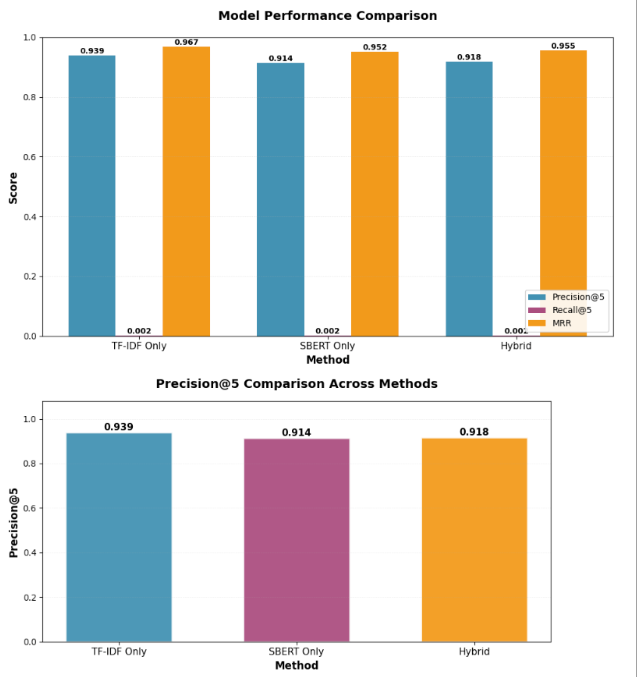

# CareerSwytch - Swytch Station 2B

---

### 👥 **Team Members**

| Name | GitHub Handle | Contribution |
|------------------|---------------|--------------------------------------------------------------------------|
| Sanah Singh | @sanahsp | Dataset collection and preparation, presentation, overall project coordination |
| Zaki Khan | @zaki-m-khan | Model training, future application - resume analyzer, Notion organization |
| Meera James | @meerajames | Data understanding and preparation, model training |
| Favour Adesoye | @FavourAdesoye | Model selection, model evaluation, results interpretation |

---

## 🎯 **Project Highlights**

- Built a resume–job description matching system to support people navigating career transitions
- Developed and compared TF-IDF, SBERT, and a Hybrid NLP model for similarity-based ranking
- Used ranking-based evaluation metrics (Precision@K, Recall@K, MRR)
- Demonstrated how NLP techniques can surface transferable skills

---

## 🛠️ **Setup and Installation**

### 1. Clone the repository or download the notebook directly
```bash
git clone https://github.com/zaki-m-khan/swytchstation2B.git
```

Alternatively, download the notebook file directly:
- Navigate to `notebooks/swytchstation2BFinalModel.ipynb`
- Click "Raw" or "Download" to save the file locally

### 2. Open in Google Colab
- Upload the `swytchstation2BFinalModel.ipynb` notebook to Google Colab
- Select **Runtime → Run all**

### 3. Install Dependencies
All dependencies are installed inside the notebook:
- pandas
- scikit-learn
- nltk
- sentence-transformers
- numpy

### Dataset Setup

#### Steps to Upload Data
1. Download the datasets from `swytchstation2B/data/`
2. In Google Colab:
   - Click the **Files** icon
   - Upload the dataset files (.csv)
     - `swytchstation2BJobDescription.ipynb` → `job_title_des.csv`
     - `swytchstation2B.ipynb` → `Resume.csv`
3. Ensure the files are uploaded to: `/content/`

---

## 🏗️ **Project Overview**

This project was developed as part of the **Break Through Tech AI Program**, an initiative designed to equip students from underrepresented backgrounds with hands-on experience applying machine learning to real-world, industry-relevant problems.

This project was completed in collaboration with **Swytch Station** through the Break Through Tech AI Studio experience. The project objective is to analyse public resume and job posting data to support both linear and non-linear career transitions.

Navigating career pathways can be challenging, especially for students and early-career professionals who may not clearly see how their skills translate across industries. The long-term vision is to create a scalable tool that empowers individuals to make informed career decisions.

---

## 📊 **Data Exploration**

### Dataset
- **Source:** Kaggle
- **Type:** Resume text and job description text
- **Format:** CSV
- **Data Type:** Unstructured text

### Preprocessing Techniques
- Text cleaning and normalization
- Lemmatization
- Efficient vectorization for large text data

### Challenges
- Inconsistent job terminology (e.g., "ML Engineer" vs "Data Scientist")
- No direct resume-to-job ground truth mapping

---

## 🧠 **Model Development**

### Models Used

Three text-based similarity models were developed and compared:

#### 1. TF-IDF (Term Frequency–Inverse Document Frequency)
- Captures keyword importance and domain-specific terminology
- Performs strongly when job descriptions contain precise industry language

#### 2. SBERT (Sentence-BERT)
- Generates semantic embeddings to capture contextual meaning
- Effective for understanding similarities beyond exact keyword overlap

#### 3. Hybrid Model
- Weighted combination of TF-IDF and SBERT similarity scores
- Designed to balance lexical precision and semantic understanding

### Feature Engineering
- Text cleaning and normalization
- Lemmatization to reduce words to their base forms
- Extraction of structured information such as:
  - Skills
  - Tools/technologies
  - Education levels
- Creation of a combined textual representation to enrich model inputs

### Training & Evaluation Setup
- Models were trained using job descriptions and evaluated against resume data
- Performance was assessed using ranking metrics:
  - **Precision@k** – accuracy of top-k recommendations
  - **Recall@k** – coverage of relevant industries
  - **MRR (Mean Reciprocal Rank)** – position of the first correct match

---

## 📈 **Results & Key Findings**

### Evaluation Metrics
- Precision@5
- Recall@5
- Mean Reciprocal Rank (MRR)

### Model Performance



|          | Precision@5 | Recall@5 | MRR   |
|----------|-------------|----------|-------|
| TF-IDF   | 0.939       | 0.002    | 0.967 |
| SBERT    | 0.914       | 0.002    | 0.952 |
| Hybrid   | 0.918       | 0.002    | 0.955 |

### Key Insights
- TF-IDF captures keyword overlap but not semantic meaning
- Cleaning and normalization significantly affect similarity scores
- Ranking-based evaluation better reflects real-world use cases

---

## 🚀 **Next Steps**

### Current Limitations
- Industry labels are inferred rather than ground-truth annotated
- Recall values are low due to narrow category definitions
- Model performance is sensitive to dataset composition and industry imbalance

### Future Improvements

With more time and resources, the following enhancements could be explored:
- Incorporating human-labeled industry annotations for supervised evaluation
- Expanding industry taxonomies beyond technical roles (e.g., sales, marketing, healthcare)
- Introducing skill ontology or knowledge graphs for richer reasoning

---

## 📝 **License**

The project is not open source.

---

## 🙏 **Acknowledgements**

Thank you to our Challenge Advisor, host company representatives, TA, and others who supported this project.
